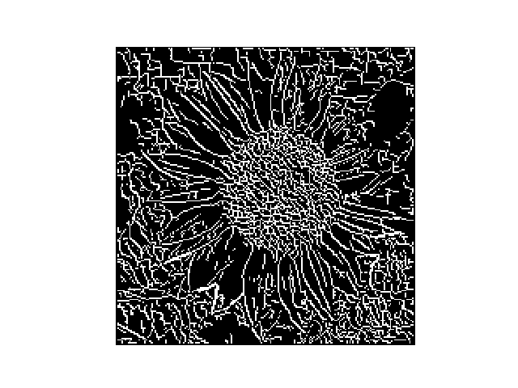
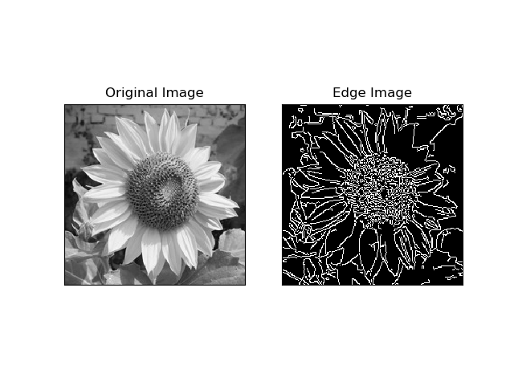
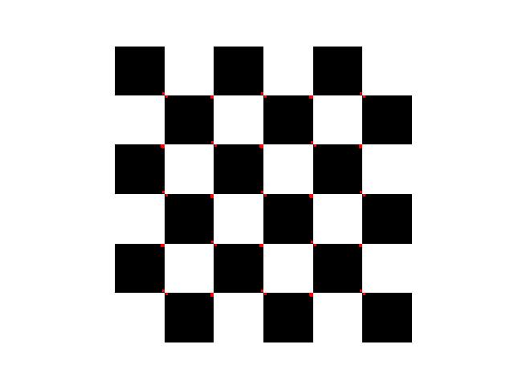
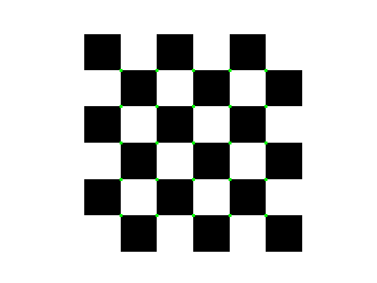

#**Canny Edge Detector** 

###**Algorithm Steps :-**
1. Take the gray scale of the image
2. Image smoothning using Gaussian Filter
3. Calculate derivative of filtered image
4. Find magnitude and direction of edge
5. Apply Non-MaximalSuppression on resultant matrix
6. Apply Hysteresis Thresholding

#####**Input Image -**

#####**Output using algorithm implementation -**

#####**Output using opencv in-built function -**

#**Harris Corner Detection**

###**Algorithm Steps :-**
1. Take the gray scale of the image
2. Apply gaussain filter to remove noise
3. Apply sobel operator to find derivative in x and y directon
4. For each pixel in the grayscale image, compute the corner strength function. It's known as Harris Value.
5. Find all pixels that exceed a certain threshold
6. For each pixel that satisfy condition in step5 compute a feature descriptor

#####**Input Image -**

#####**Output using algorithm implementation -**

#####**Output using opencv in-built function -**

