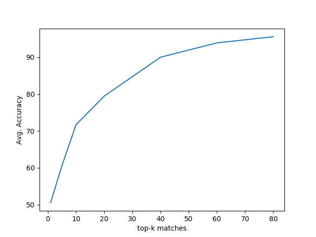
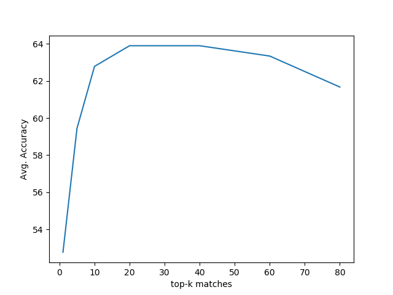

#**SIFT and ORB feature matching**

###**Algorithm Steps:-**
1. Take the gray scale of images
2. For convention we reduced the size of the image if needed (less computation)
3. Find the descriptor of images using sift or orb method
4. For any key image, compute distance b/w it's decriptor and other image descriptor points. One keypoint is matched to another image keypoint for which we get min distnace between them. 
5. For the key image, another image which has min avg of top k distances (decreasing order,sorted) than other images for the key image is matching image of key image.
   
#####**Output Accuracy for SIFT algorithm-**

  

#####**Output Accuracy for ORB algorithm-**

###**Problem Statement:-**

1. Capture 6 images of 10 different scenes of your choice using a hand-held camera like cellphone's camera without using a tripod. Resize the images so that max(row,column)<=1024 while keeping the aspect ratio of the image intact.
2. Make sure there are no moving objects present in the scene and there should be some angle variation between the images.
3. Using SIFT and ORB feature matching, given a query image retrieve the top-5 similar images from the pool of remaining 59 images. (built-in functions for feature extraction is allowed but for matching are not allowed)
4. Use sum of euclidean distances between top-k matches of the features of a pair of images as the ranking criteria. (value of k should be decided by you but it should be more than 10.)
5. To obtain the accuracy consider each image in your dataset as a query once and check how many of the other 5 images of the same scene you are able to retrieve among the top-5 images from the step 3. For e.g.- for a query image if you are able to retrieve 4 out of 5 images of the same scene, then it is 80% accuracy. Do this for all the images present in your dataset.
6. Report the average image retrieval accuracy with a value of k of your choice for both SIFT and ORB features.
7. Plot a graph of the average retrieval accuracy for the values of k = 1,5,10,20,40,60,80 and max matches.
Note: The assignment will not be graded solely based on the final retrieval accuracy. The complexity of the dataset and the complete implementation will be considered for the evaluation of the assignment.